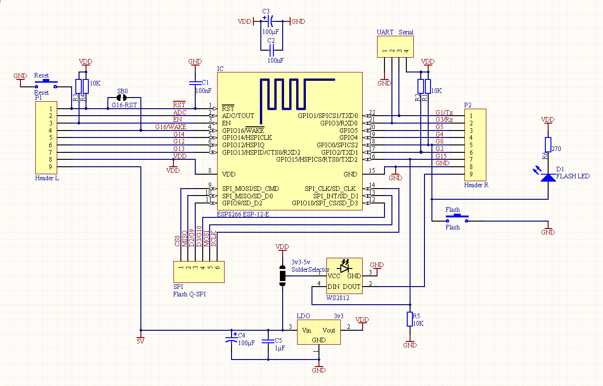
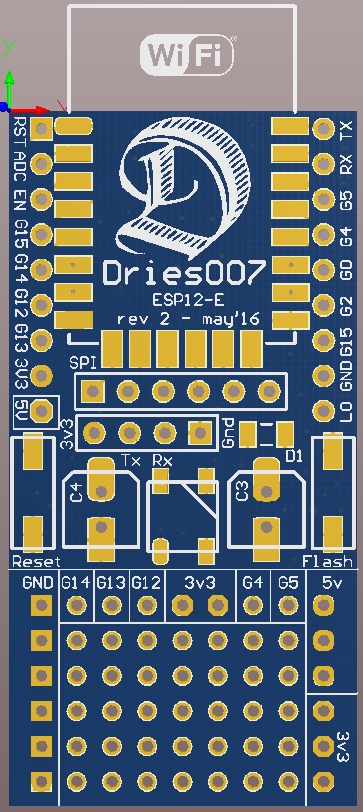
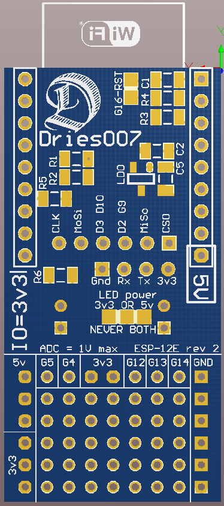
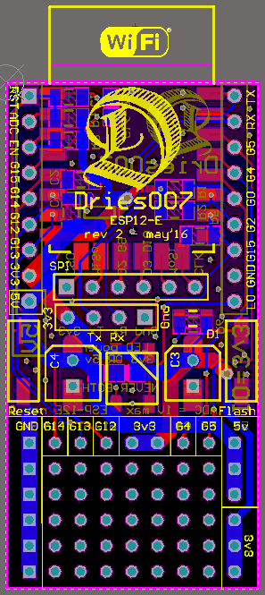

MicroPythonUtils
================

My collection of bits and bobs I use to work with my ESP2866 ESP12-E

Most of these tools where made to facilitate my development on my own custom ESP12-E Breakouts.
You can find the files of those boards in my [Altium library](https://github.com/dries007/Altium).

This PCB includes:

- Space for the ESP-12-E. (ESP-12, ESP-12-F, or ESP-14 should also work)
- Breadboard friendly spaced headers for all 'usefull' pins.
- Headers (on top) for UART.
- Headers (on top) for Flash Quad-SPI.
- All the required pull resistors and filter capacitors. (smd or through-hole elcos)
- Reset switch.
- Programming switch (GPIO 0), also has an extra LED.
- WS2812 RGB LED (GPIO15), with Dout pin also broken out. (Pick between 5v and 3v3.)
- 5v to 3v3 regulator.
- 7 x 5 Prototype area with GND, 5V, and 3v3 rails and GPIO4, 5, 12, 13, and 14 pins.
- Silkscreen for all of it.
- Solder bridge for GPIO16 and reset. (For MicroPython's Deep Sleep) 

